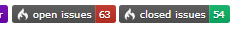

# ApiExtend MantisBT Plugin

- [ApiExtend MantisBT Plugin](#ApiExtend-MantisBT-Plugin)
  - [Description](#Description)
  - [Installation](#Installation)
  - [Issues and Feature Requests](#Issues-and-Feature-Requests)
  - [REST API](#REST-API)
    - [GET: /plugins/ApiExtend/api/issues/count/{project}/{type}](#GET-pluginsApiExtendapiissuescountprojecttype)
    - [GET: /plugins/ApiExtend/api/issues/countbadge/{project}/{type}](#GET-pluginsApiExtendapiissuescountbadgeprojecttype)
    - [GET: /plugins/ApiExtend/api/version/{project}/{type}](#GET-pluginsApiExtendapiversionprojecttype)
    - [GET: /plugins/ApiExtend/api/versionbadge/{project}/{type}](#GET-pluginsApiExtendapiversionbadgeprojecttype)

## Description

This plugin extends the MantisBT REST API.  This plugin was developed and tested on MantisBT 2.21.1.

## Installation

Extract the release archive to the MantisBT installations plugins folder:

    cd /var/www/mantisbt/plugins
    wget -O ApiExtend.zip https://github.com/mantisbt-plugins/ApiExtend/releases/download/v1.0.0/ApiExtend.zip
    unzip ApiExtend.zip
    rm -f ApiExtend.zip

Ensure to use the latest released version number in the download url:  (version badge available via the [ApiExtend Plugin](https://github.com/mantisbt-plugins/ApiExtend))

Install the plugin using the default installation procedure for a MantisBT plugin in `Manage -> Plugins`.

For Apache configuration, see the example Location directive found in api/apache2-site-config

## Issues and Feature Requests

Issues and requests should be submitted on my [MantisBT](https://app1.spmeesseman.com/projects/set_project.php?project=ApiExtend&make_default=no&ref=bug_report_page.php) site.

## REST API

The extended REST API can be authenticated in one of two ways:

1. Set the API user and API token in the Plugin settings for dedicated API acess using one static account.
2. Set the `Authorization` header value to a user API token for specific user access.

In either case, the token can be created in User Preferences for the user that will be used to make the requests under.

In case 1, the authorization token can be sent as a GET or POST parameter as opposed to having to be sent in the header.  This allows the svg badges to be linked to from within a README file.

For example:

    Authorization: DvhKlx9_g5dNkBEI4jqVmwAxaN9a1y3P

The following endpoints are available to automatically create/update releases with assets/files:

### GET: /plugins/ApiExtend/api/issues/{project}/{type}

Retrieved issues with a given set of filter key/value pairs.

Where `project` is the MantisBT project name

Where `type` is one of 'open', 'closed', or 'all'.

Example JSON Request

    GET `https://my.domain.com/mantisbt/plugins/ApiExtend/api/issues/ProjectName/all`
    content-type: application/json
    {
        "filters": "[{\"property\": \"custom_field_3\",\"value\": \"u1\"},{\"property\": \"custom_field_4\",\"value\": \"u2\"}]"
    }

The filters paramenter should be url encoded and provided in the URL as a GET parameter.

### GET: /plugins/ApiExtend/api/issues/count/{project}/{type}

Retrieves an issues count for open or closed issues.

Where `project` is the MantisBT project name

Where `type` is one of 'open' or 'closed'.

Example JSON Response Body

    {
        "count": 132
    }

### GET: /plugins/ApiExtend/api/issues/countbadge/{project}/{type}

Retrieves an issues count badge for open or closed issues, for use in readme files.

Where `project` is the MantisBT project name

Where `type` is one of 'open' or 'closed'.

### GET: /plugins/ApiExtend/api/version/{project}/{type}

Retrieves the current and/or next version.

Where `project` is the MantisBT project name

Where `type` is one of 'open' or 'closed'.

Example JSON Response Body

    {
        "version": 1.9.19
    }

### GET: /plugins/ApiExtend/api/versionbadge/{project}/{type}

Retrieves a versionbadge for the current and/or next version, for use in readme files.

Where `project` is the MantisBT project name

Where `type` is one of 'open' or 'closed'.

Supported GET parameters:

|Parameter Name|Description|Type|Default Value|
|-|-|-|-|
|color|The badge color, do not prepend the hash '#'|string|0E7FBF|

Example request url:

    https://app1.spmeesseman.com/projects/plugins/ApiExtend/api/versionbadge/Releases/current?color=D7A54A
